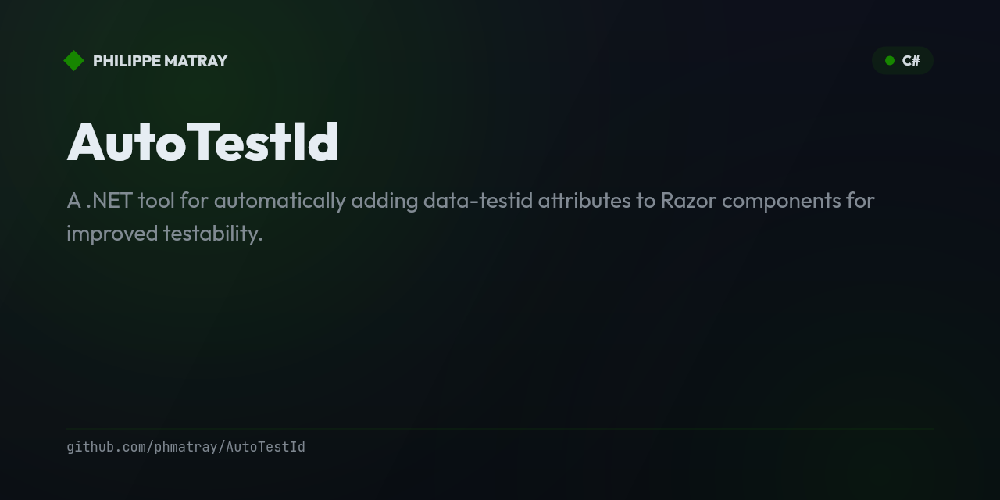

# AutoTestId

<!-- portfolio-badges:start -->
<!-- Identity -->
[](https://github.com/phmatray/AutoTestId)

[](https://github.com/phmatray/AutoTestId/stargazers)
[](https://github.com/phmatray/AutoTestId/network/members)
[](https://github.com/phmatray/AutoTestId/blob/HEAD/LICENSE)

<!-- Activity -->
[](https://github.com/phmatray/AutoTestId/issues)
[](https://github.com/phmatray/AutoTestId/pulls)
[](https://github.com/phmatray/AutoTestId/commits)
<!-- portfolio-badges:end -->

<!-- portfolio-toc:start -->

## Table of Contents

- [Features](#features)
- [Installation](#installation)
- [Usage](#usage)
- [How It Works](#how-it-works)
- [Command Reference](#command-reference)
- [Development](#development)
- [Tech Stack](#tech-stack)
- [License](#license)
- [Contributing](#contributing)

<!-- portfolio-toc:end -->


A .NET tool for automatically adding `data-testid` attributes to Razor components for improved testability.

## Features

- **Automatic test-id injection**: Adds `data-testid` attributes to root-level HTML elements in Razor files
- **Multiple processing modes**: Process single files, folders, projects, or entire solutions
- **Smart detection**: Only processes files that need updates
- **Preserve formatting**: Maintains your existing code formatting and indentation
- **Replace existing**: Updates existing `data-testid` attributes if present
- **Dry-run mode**: Preview changes before applying them
- **Beautiful CLI**: User-friendly command-line interface with progress reporting

## Installation

```bash
dotnet tool install -g AutoTestId
```

Or build from source:

```bash
git clone https://github.com/yourusername/AutoTestId.git
cd AutoTestId
dotnet build
```

## Usage

### Process a Single File

```bash
autotestid file Component.razor

# With custom test-id
autotestid file Component.razor --test-id "MyCustomId"

# Preview changes without modifying
autotestid file Component.razor --dry-run
```

### Process a Folder

```bash
autotestid folder ./src

# Process recursively (default)
autotestid folder ./src --recursive

# Exclude specific directories
autotestid folder ./src --exclude bin --exclude obj

# Custom file pattern
autotestid folder ./src --pattern "*.razor"
```

### Process a Project

```bash
autotestid project MyApp.csproj

# Preview changes
autotestid project MyApp.csproj --dry-run

# Exclude directories
autotestid project MyApp.csproj --exclude wwwroot
```

### Process a Solution

```bash
autotestid solution MyApp.sln

# Exclude specific projects
autotestid solution MyApp.sln --exclude-project "Tests"

# Include test projects (excluded by default)
autotestid solution MyApp.sln --include-tests

# Process only specific projects
autotestid solution MyApp.sln --include-project "MyApp.Web" --include-project "MyApp.Components"
```

## How It Works

AutoTestId processes Razor files and adds `data-testid` attributes to all root-level HTML elements:

**Before:**
```razor
<div class="card">
    <h2>@Title</h2>
    <p>@Description</p>
</div>

<footer>
    <span>@Copyright</span>
</footer>
```

**After:**
```razor
<div data-testid="ProductCard" class="card">
    <h2>@Title</h2>
    <p>@Description</p>
</div>

<footer data-testid="ProductCard">
    <span>@Copyright</span>
</footer>
```

The test-id value is derived from the component filename (without extension) by default.

## Command Reference

### Global Options

- `-h, --help` - Show help information
- `-v, --version` - Show version information

### File Command

Process a single Razor file.

**Arguments:**
- `<FILE>` - Path to the Razor file to process

**Options:**
- `-t, --test-id <ID>` - Custom test ID value to use (defaults to filename)
- `-d, --dry-run` - Preview changes without modifying files

### Folder Command

Process all Razor files in a folder.

**Arguments:**
- `<FOLDER>` - Path to the folder containing Razor files

**Options:**
- `-r, --recursive` - Process subdirectories recursively (default: true)
- `-p, --pattern <PATTERN>` - File pattern to match (default: *.razor)
- `-d, --dry-run` - Preview changes without modifying files
- `-e, --exclude <DIR>` - Directories to exclude (can be specified multiple times)

### Project Command

Process all Razor files in a .csproj project.

**Arguments:**
- `<PROJECT>` - Path to the .csproj file

**Options:**
- `-d, --dry-run` - Preview changes without modifying files
- `-l, --include-linked` - Include linked files in processing
- `-e, --exclude <DIR>` - Directories to exclude (can be specified multiple times)

### Solution Command

Process all Razor files in a .sln solution.

**Arguments:**
- `<SOLUTION>` - Path to the .sln file

**Options:**
- `-d, --dry-run` - Preview changes without modifying files
- `-i, --include-project <NAME>` - Specific projects to include (can be specified multiple times)
- `-e, --exclude-project <NAME>` - Projects to exclude (can be specified multiple times)
- `-t, --include-tests` - Include test projects in processing

## Development

### Running Tests

```bash
dotnet test
```

### Building

```bash
dotnet build
```

### Running Locally

```bash
dotnet run -- file MyComponent.razor
```

<!-- portfolio-techstack:start -->

## Tech Stack

- **.NET 9**
- Shouldly
- xunit.v3
- xunit.runner.visualstudio
- Spectre.Console.Cli

<!-- portfolio-techstack:end -->

<!-- portfolio-roadmap:start -->

## Roadmap

Planned work and known limitations are tracked in the [open issues](https://github.com/phmatray/AutoTestId/issues). Contributions toward them are welcome.

<!-- portfolio-roadmap:end -->

## License

MIT License - see LICENSE file for details.

---

<!-- portfolio-sections:start -->

## Contributing

Contributions are welcome. Open an issue first to discuss any significant change.

1. Fork the repository and create your branch (`git checkout -b feat/my-feature`)
2. Commit your changes (`git commit -m 'feat: ...'`)
3. Push the branch and open a Pull Request

<!-- portfolio-sections:end -->

<!-- portfolio-nugetkeep:start -->
---
Built by [Atypical Consulting](https://www.atypical.consulting). We also make
[NuGetKeep](https://nugetkeep.com/?utm_source=github-readme&utm_medium=readme&utm_campaign=launch-2026-07),
a self-hosted NuGet server with supply-chain quarantine.
<!-- portfolio-nugetkeep:end -->
